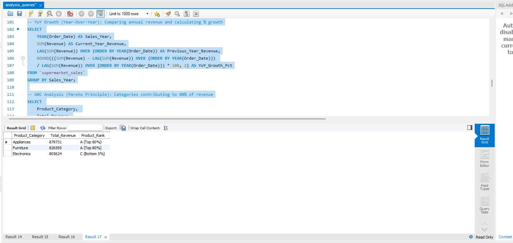
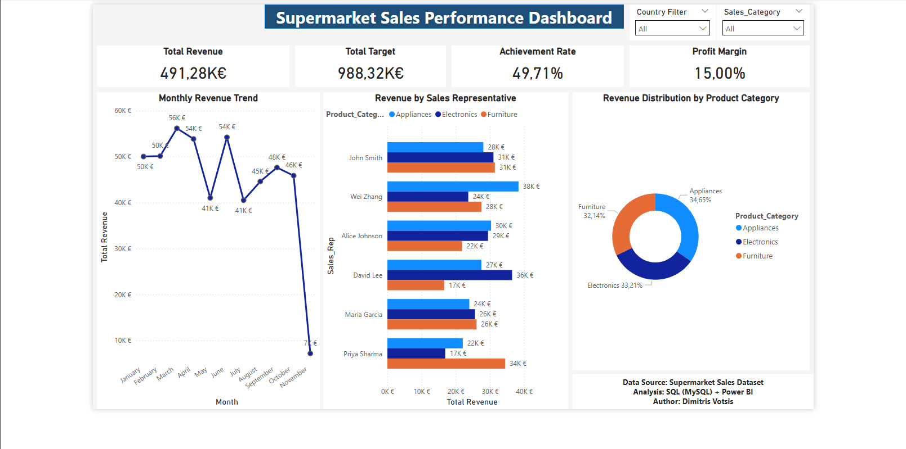

# 🛒 Supermarket Sales & Performance Analysis (Advanced SQL)

## 📌 Project Overview
This project delivers a comprehensive, end-to-end commercial data analysis infrastructure for a multinational supermarket chain. Moving from raw transaction records to production-ready insights, the project leverages **Advanced SQL (MySQL)** for deep analytical computations and **Power BI** to map out macro-level corporate growth, sales representative efficiency, and inventory optimizations.

## 🎯 Objectives
*   Decompose and analyze revenue distribution maps across various product verticals and geographic regions.
*   Audit and evaluate Sales Representative performance matrixes against dynamic targets.
*   Execute granular time-series analysis to calculate cumulative metrics and multi-period fiscal trends.
*   Apply advanced management frameworks like the **Pareto Principle (ABC Analysis)** to optimize inventory capital allocation.

## 🛠 Tools & Technologies
*   **Database Infrastructure:** MySQL Server (Advanced Query Engineering)
*   **Business Intelligence Layer:** Power BI Desktop (Data Modeling & Master View Integration)
*   **Analytical Frameworks:** Window Functions (`RANK`, `LAG`, `SUM OVER`), Subqueries, Conditional Case Logic

## 📊 Advanced Analytical Frameworks & SQL Logic
To ensure data accuracy and robust reporting, complex business metrics were pre-calculated directly on the database layer using advanced analytical frameworks.

### 1. Inventory Optimization via ABC Analysis (Pareto Principle)
Products are not commercially equal. This script programmatically calculates the cumulative revenue share of each product category using window functions and groups them into strategic tiers (Tier A drives the core 80% of corporate value, Tier B represents the next 15%, and Tier C isolates low-velocity items making up the bottom 5%):

```sql
SELECT 
    Product_Category, 
    Total_Revenue,
    CASE 
        WHEN Cumulative_Pct <= 80 THEN 'A (Top 80%)'
        WHEN Cumulative_Pct <= 95 THEN 'B (Next 15%)'
        ELSE 'C (Bottom 5%)'
    END AS Product_Rank
FROM (
    SELECT 
        Product_Category, 
        SUM(Revenue) AS Total_Revenue,
        100 * SUM(SUM(Revenue)) OVER (ORDER BY SUM(Revenue) DESC) / SUM(SUM(Revenue)) OVER () AS Cumulative_Pct
    FROM `supermarket_sales`
    GROUP BY Product_Category
) AS ABC_Subquery;
```

### 2. Time-Series Calculations: Year-Over-Year (YoY) Growth
To track true corporate trajectory without seasonal distortion, this script utilizes the `LAG()` analytical window function to isolate chronological variance, comparing a specific fiscal period’s performance directly against the exact baseline of the prior year:

```sql
SELECT 
    YEAR(Order_Date) AS Sales_Year,
    SUM(Revenue) AS Current_Year_Revenue,
    LAG(SUM(Revenue)) OVER (ORDER BY YEAR(Order_Date)) AS Previous_Year_Revenue,
    ROUND(((SUM(Revenue) - LAG(SUM(Revenue)) OVER (ORDER BY YEAR(Order_Date))) 
    / LAG(SUM(Revenue)) OVER (ORDER BY YEAR(Order_Date))) * 100, 2) AS YoY_Growth_Pct
FROM `supermarket_sales`
GROUP BY Sales_Year;
```

## 📉 Database Architecture & BI Optimization
Instead of importing messy tables into Power BI and overloading the tool with calculated columns, this pipeline relies on a consolidated **Master View** (`View_Final_Analysis`). This layer pre-calculates organizational KPIs, performance percentages, and financial estimations (such as an estimated 15% profit margin) before ingestion, maximizing dashboard responsiveness.

```sql
CREATE OR REPLACE VIEW View_Final_Analysis AS
SELECT 
    Order_ID, Order_Date,
    YEAR(Order_Date) AS Sales_Year,
    MONTHNAME(Order_Date) AS Month_Name,
    Product_Category, Country, Sales_Rep, Team,
    Revenue, Target, Units_Sold,
    ROUND((Revenue / Target) * 100, 2) AS Achievement_Pct,
    CASE 
        WHEN Revenue > 50000 THEN 'High Value'
        WHEN Revenue BETWEEN 20000 AND 50000 THEN 'Medium Value'
        ELSE 'Low Value'
    END AS Sales_Category,
    ROUND(Revenue * 0.15, 2) AS Estimated_Profit
FROM `supermarket_sales`;
```

### 📊 SQL Query Result Preview
### Multi-Period Growth Diagnostics


## 📈 Interactive Dashboard View
### Executive Commercial Performance Dashboard


## 🚀 Strategic Business Insights Generated
*   **Capital Allocation Protection (ABC Tiering):** Isolated the specific Class A product categories that generate 80% of total supermarket turnover. This insight allows logistics teams to prioritize stock assurance for high-velocity goods while minimizing cash tied up in Class C inventory.
*   **Localized Performance Diagnostics:** Implemented localized matrix ranking via `RANK() OVER (PARTITION BY Country ORDER BY SUM(Revenue) DESC)` to isolate top-tier sales representatives per country. This mapping helps management identify regional sales leaders and pinpoint reps consistently falling below operational targets (`HAVING Achievement_Percentage < 100`).
*   **Running Totals & Seasonality Monitoring:** Established explicit running total calculations (`SUM(Revenue) OVER (ORDER BY Order_Date)`) to allow stakeholders to monitor cumulative corporate growth over time and pinpoint seasonal revenue spikes across specific quarters.

## 📁 Project Structure
*   **01_Data/**: Raw supermarket transaction history data batches.
*   **02_SQL/**: Advanced database scripts covering Window Functions, Data Auditing, and optimization Views.
*   **03_PowerBI/**: Relational data models, DAX structures, and semantic matrix layouts.
*   **04_Screenshots/**: Validated database console execution screenshots and BI layout mockups.
